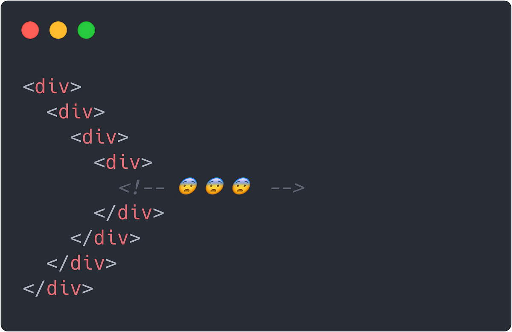

# Reflection of UI frameworks
The general experience of working with Bootstraps has made many aspects of front-end development easier, but even with the framework development was still a nuisance. Developing UIs in general is enjoyable for me because I can see what it is that I am designing and changing UI, but the actual coding aspects makes me want to bash my head into a wall. Bootstraps added many things that we could add to a DIV to efficiently make things like navbars and Icons so we don’t have to manually make or import images.

# Experience of frameworks
During our WODS and practice WODS we practiced with the Bootstrap framework to get used to using the framework but writing. I like developing the code line by line and seeing how every little thing changes something and that I could see the change as I actively rewrote my code. Unlike back-end development I would have to write an in-line test method or print statements to check everything to see if they function correctly. Now that I’ve had a weeks worth of experience of UI design every time I see a webpage, all i hear is “DIV DIV DIV DIV DIV”, DIVs were everywhere DIV this DIV that and if you forgot a DIV or didn't use a DIV then the webpage usually wouldn't look like how it should.

# Bootstraps imports
The imports that we could use for Bootstraps that I enjoyed the most during this experience was the Icon import. This allowed me to write something like <i class=”bi bi-facebook”> to set up the icon for a navbar or a link to another page that many webpages use. Without this import I would not be able to replicate the different web pages that we have made. I found this import to be the most useful and definitely plan to implement this in future projects. 

# Conclusion
In conclusion, working with Bootstrap has streamlined front-end development, making tasks like creating nav bars and icons much easier, though coding UI can still feel tedious. Despite the challenges, I enjoyed the process of seeing immediate visual changes and found Bootstrap's icon imports particularly useful. This experience has deepened my appreciation for UI design and will definitely influence how I approach future projects.

