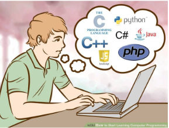

 
<h2 style="color: purple;  margin-left: 300px;">Welcome to TypeScript</h2>
Being an ICS undergrad student we have been thrown into various languages to learn like Java, C, C++, Python, and Typescript. These experiences as an undergraduate are to find ourselves; to figure out who we are or want to be after we graduate under the ICS major. So in our ICS 314 class, my experience with Typescript has been phenomenal. I love how easily the flow of the language is. Having experience with the various languages heavily impacted how easily I could pick up on Typescript since all coding languages can do the same job, but do it differently in terms of how you communicate with the computer via syntax. Everything I have learned from the assignments thus far was more of a refresher to get me back into the groove of coding after a long summer break.    As a novice coder, I cannot say I see a difference between the different languages. Coding in different languages throughout my courses I have felt that there have been minimal differences between the languages, but specifically, I have Typescript and Python on the same level as my favorite just because I find that these languages are easy to understand and use.In languages like Java, I struggled to create classes because I didn’t understand the many different labels in the classes. For example, as we were learning about Java, we struggled to understand static, void, private, and public. Using C/C++ was a great way for me to learn the basics of coding, since C is a low-level language you had to create everything rather than having easy shorts like Typescripts and Python. The main thing I struggled with in C/C++ was the utilization of pointers. Using pointers to transfer data to another part of the program was the hardest concept for me to learn throughout my coding journey. 

  

<h2 style="color: purple;">The start to a valiant journey</h2>
The athletic software engineering has been very humbling while being an amazing learning experience. The WODs are the perfect introduction to a skill I have been trying to learn for the past year. I have been trying to learn Leetcode by doing easy problems, but with every problem I have tried I get stuck and end up with an incomplete code and just look up the answer to try to learn and understand what people coded and their thought process. With the WODs I have a time frame I can follow to see my progress and know where to stop so I don't waste my time. In the last two WODs we have had I have had a DNF where my code was unable to accomplish the task provided. Having the video solutions allows me to get an in-depth tutorial on what to do and how to approach the problem to get the solution. I feel that this is the perfect learning style for me, but one problem with this style is that it makes me quick to give up. I tend to get overwhelmed and have a panic attack when I have passed the one-minute mark and I have yet to write a single line of code to the point where I will sit there staring at the screen. One thing I have learned to do to combat this is to brainstorm what to do and possible solutions to attempt so that I end up doing nothing.

